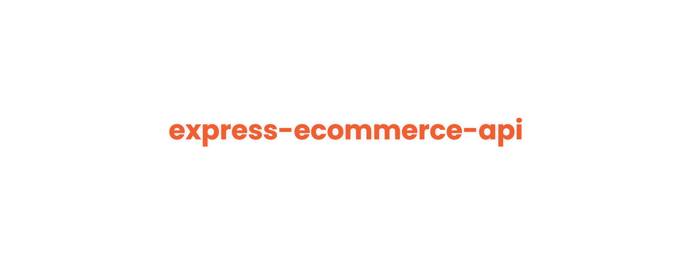

<!-- markdownlint-disable MD014 -->
<!-- markdownlint-disable MD026 -->
<!-- markdownlint-disable MD033 -->
<!-- markdownlint-disable MD041 -->

<h1 align="center">
  express-ecommerce-api
</h1>

<!-- Banner Section -->

  

<h3 align="center">
  Express E-commerce API
   
   
  <!-- <a href="#">
    Click to visit the website
  </a> -->
</h3>

---

<!-- Badges Section -->

  
  <!-- 
  
  
   -->

---

<!-- Translations Section -->

<!-- ## 🌎 Translations -->

<!-- <kbd></kbd>
<kbd></kbd> -->

<!-- Introduction Section -->

## 📖 Introduction

This repo shows my implementation for e-commerce API, with Express and Mongoose.

<!-- License Section -->

## 📜 License

This project is licensed under the **MIT License** - see the [LICENSE](LICENSE) page for details.

<!-- Acknowledgment Section -->

---

### ❤️ Thanks for your attention!
